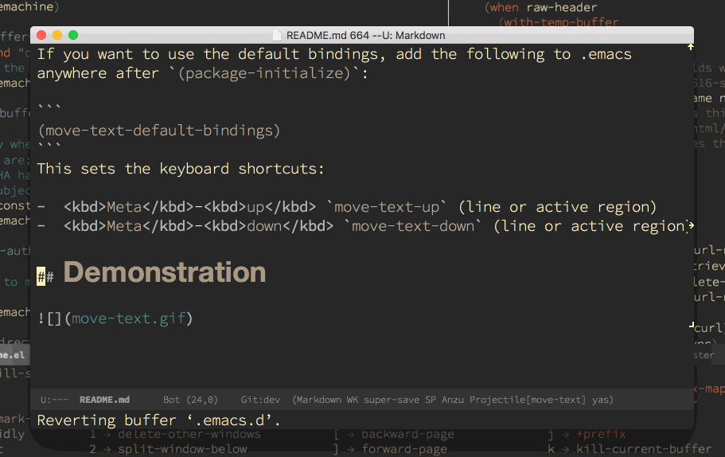

[](http://melpa.milkbox.net/#/move-text)
[](http://melpa-stable.milkbox.net/#/move-text)

# MoveText

MoveText is extracted from Basic edit toolkit.
It allows you to move the current line using M-up / M-down (or any other bindings you choose)
if a region is marked, it will move the region instead.

Install from MELPA (or MELPA stable)

```
M-x package-install move-text <RETURN>
```

If you want to use the default bindings, add the following to .emacs
anywhere after `(package-initialize)`:

```
(move-text-default-bindings)
```
This sets the keyboard shortcuts:

-  <kbd>Meta</kbd>-<kbd>up</kbd> `move-text-up` (line or active region)
-  <kbd>Meta</kbd>-<kbd>down</kbd> `move-text-down` (line or active region)

## Demonstration


